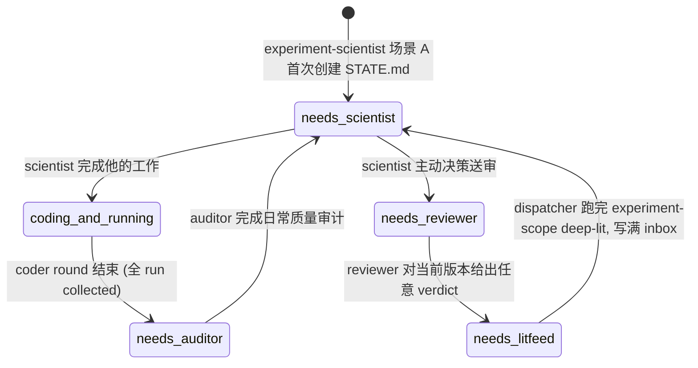
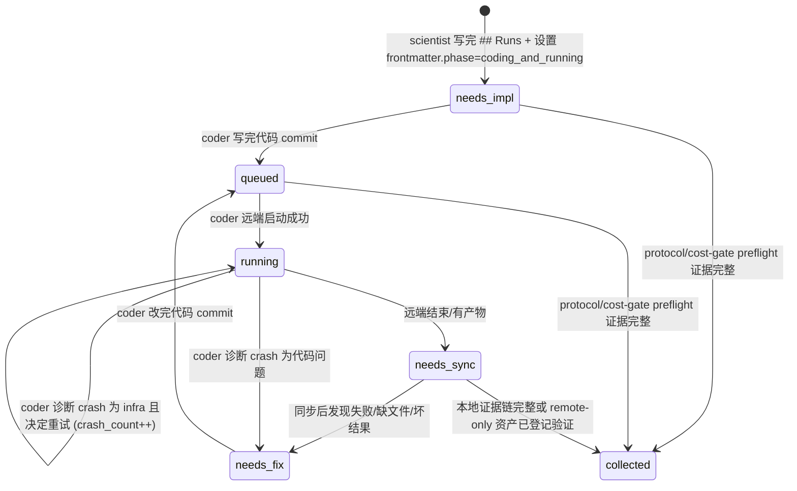

# 实验工厂手册

## 角色与分工

- experiment-scientist, "lead scientist": 读 results, 做战略决策, 给 coder 写具体 plan.
- experiment-coder, "technical ML/research engineer": 按 scientist 或 investigator 的 WorkItem 写代码/检查, 部署, 监控, 诊断, 同步结果并记录资源开销.
- experiment-auditor, "experiment-loop adversarial QA": scientist 前置的日常质量负责人, 审计上一轮 plan / code / results / operations, 维护 STATE.md 结构与一致性, 要求 scientist 逐条回应.
- experiment-reviewer, "experiment-domain reliability reviewer": 对当前 STATE version 做独立可靠性审查, 给直接复现实验的 claim evidence / execution correctness / failure attribution / reportability 打分并出 verdict.
- investigator / inves-auditor / inves-reviewer: 组成 investigation domain 的独立审查 loop, 维护 `INVES.md`, 负责文献关系、artifact/data/benchmark、cherry-pick、overclaim 和适用边界。investigator 类似 scientist, 负责规划和整合 investigation checks; inves-auditor 类似 auditor, 负责过程质量审计; inves-reviewer 类似 reviewer, 负责给 investigation evidence profile 打 verdict/score。investigator 直接调用 `deep-lit-reader` 读取指定论文, 系统性文献补充走 `deep-lit-tick --scope investigation` 且必须严格按 prompt 大规模多读; 它们向共享 experiment-coder 投递 `state_file=INVES.md` 的 WorkItem.

## 两个审查域的硬边界

本项目中的“内部实验复现”和“外部可靠性审查”既规定问题及其状态所有权, 也规定 investigation 的硬执行上限。evidence 来自论文内部还是互联网、代码在本机还是远端都不改变这个上限。后续 prompt 中的 `internal` / `external` 必须按下面的定义理解:

- **experiment domain (`STATE.md`-owned, 内部实验复现)**: 直接执行、复现或重建目标论文明确声称的方法、数据、协议、表格、图和指标, 判断 target claim 在记录清楚的 artifact / environment / budget 下得到什么结果, 并区分 paper claim、artifact、环境、数据、metric、our bug、budget 和 unknown failure attribution。
- **investigation domain (`INVES.md`-owned, 外部可靠性审查)**: 轻量、快速的外部核查。像考官拿到一张考卷——不做题，只用心算、常识、极端情况检查和经验来快速判断试卷质量。具体手段包括：跨文献 triangulation（后续论文支持/反驳、独立复现/失败复现、repo/issue/社区争议）、数据自洽性心算（论文自己的数字能否互相印证、table 和 figure 是否自洽）、常识压力测试（声称的效应量在已知的 embedding distribution 下是否 plausible、有无 trivial alternative explanation）、artifact 静态审计（代码/data/model 是否存在、版本是否匹配、checklist 是否诚实）、overclaim 措辞审计（paper actually says vs implies vs reader may infer）。**investigation 不实现也不要求 coder 实现论文的核心算法。不跑论文的实验。不训练模型。不下载模型权重做 inference。这些属于 experiment domain。** investigation 只做静态的、聪明的、快速的外部核查。差的论文在这一步就应该被筛掉，只有真正 solid 的才进入 experiment loop。

**Investigation execution ceiling（hard）**: investigation 是“考官模式”：读、对照、心算/公式推演、极端情况与 self-consistency 检查, 以及 bounded CPU/API 的静态取证。I5 只允许 URL/API/repo/issue/model-card/data-card/metadata/hash/license/version 检查、已有小文件扫描、reported-number / paper-provided small-data 重算（可写代码）和不加载权重的纯 CPU tokenizer inspection。无论检查目的为何, 都禁止在 investigation 中实现或执行目标论文的核心算法/方法/实验协议、下载 model/checkpoint weights、运行 inference、拟合或训练任何模型（包括 LR/SVM/MLP）以及使用 GPU。若一个问题只有这些工作才能回答, 只在 INVES.md 记为 `not assessed: experiment evidence required` 并说明准确缺口；不创建 I5, 不修改 STATE.md, 不新增 handoff phase/queue。

## 分级成本门禁（hard）

| Tier | 主责 | 成本上限 | 动作 |
|------|------|----------|------|
| L0 Desk Check | investigation | $0, minutes | 读 materials/ 原文 + 写 protocol extraction + 查公式/数字 self-consistency |
| L1 CPU Probe | investigation primary；experiment 独立复跑 | ~$0.01, minutes | L0 基础上跑小规模代码：用论文 reported 数据做单模型数值验证。必须产出 manifest.json + 数值结果，不能是纯文字报告 |
| L2 Light GPU | experiment | ~$1, <1 GPU-h | 最简单算法变体、单模型、最小验证 |
| L3 Full Repro | experiment | ~$50, ~10 GPU-h | 多模型、完整 conditions、multiple seeds |
| L4 Comprehensive | experiment | $100+, 50+ GPU-h | full vocabulary、all models、完整复现 |

每个可执行 I5/A3 WorkItem 必须写 `Cost tier`、cost cap、prior gate evidence、预先固定的 pass/fail criterion 和 evidence path；每条 target claim 必须有 ≥L1 plan entry（L0 protocol extraction + L1 reported-data probe），不能停留在 UNTESTED 无计划——L1 不可执行的就标 NOT_ASSESSABLE 并写原因。每条 claim/route 只有当前最低未通过 tier 可进入 Runs，higher tier 只留在 roadmap。pass 增加 confidence，可停止扩算或允许（不强制）升级；fail 必须先查 protocol/data/implementation discrepancy，禁止扩算。L1 在 investigation ceiling 内由 investigator 主做；experiment 首次 L2 前必须独立复跑 L1 并与 INVES evidence 对照，不一致时阻断 L2。若 L1 需要 weights/inference，则 investigation 记准确 gap，由 experiment-domain L1 执行；topic/reviewer 给出的总预算或目标 tier 不构成跳级许可。

| 责任 | experiment domain | investigation domain |
|------|-------------------|----------------------|
| 规划与整合 | experiment-scientist | investigator |
| 计划/状态文件 | `STATE.md` A1/A2/A3 及 §1-§6 | `INVES.md` I0-I6 |
| coder 路由 | `owner=scientist`, `state_file=STATE.md` | `owner=investigator`, `state_file=INVES.md` |
| 过程审计 | experiment-auditor, 写 `audits/` 和 STATE audit 字段 | inves-auditor, 写 `investigations/audit_*` 和 INVES I3 |
| 独立评分 | experiment-reviewer, 只评 STATE-owned reproduction evidence profile | inves-reviewer, 只评 INVES-owned investigation evidence profile |
| 时间日志 | `experiment-log.md` | `inves-log.md` |

归属判定先看检查目的；但 investigation execution ceiling 优先于目的, 触及禁项的实际 run 一律不进入 INVES I5:

1. 直接回答“目标论文明确写出的 claim 按其方法和协议实际执行后是否成立”时, 归 experiment domain。即使需要查论文、下载公开 artifact、读取外部文献或调用网络服务, 归属不变。
2. 回答“其他研究和 artifact 如何评价它”“它是否只在被挑选的 seed/config/dataset/PDE 上成立”“generality 或 overclaim 风险如何”时, 问题属于 investigation domain, 但只能用上述轻量证据动作回答；需要禁项时保留为 bounded unknown, 不转成 investigator-owned run。
3. 运行官方代码复现论文表格属于 experiment domain；审计 repo release/issue/config 缺失如何影响 artifact reliability 属于 investigation domain。复现论文明确声称覆盖的多个 PDE 属于 experiment domain；从文献和静态 artifact 检查邻近 PDE 的覆盖/overclaim 属于 investigation domain, 实际在邻近 PDE 上执行目标方法仍属于 experiment domain。
4. 两个 domain 共享 workspace 和底层 evidence, 但不共享状态所有权。角色只写自己 domain 的状态文件和日志；读取另一状态文件只作背景。需要把另一 domain 的 finding 用进本 domain 时, 必须在自己的状态文件引用准确 evidence path, 不复制、接管或改写对方的 run。
5. 两个 reviewer 分别出分。experiment-reviewer 的 `ready` 只表示 STATE-owned reproduction profile 已可报告；inves-reviewer 的 `ready` 只表示当前 INVES-owned investigation profile 已可报告。任何一个 verdict 都不是整个 AgonReproduce 项目的全局 verdict, 两个分数不得互相替代或擅自求平均。
6. 最终 report writer 从 STATE review 和 INVES review 分别取材并处理二者之间的关系。在 report writer 实现前, 任何 reviewer 都不得自称全局最终评分层。

两个 domain 共享 claim identity，但不共享状态 ownership：

- 目标论文同一条显式 claim 在 STATE/INVES 都使用同一个稳定 `C<number>`；同 ID 必须绑定相同核心 claim text 和
  source_ref。先创建 claim matrix 的角色分配 ID，后进入的角色读取并复用，禁止各自重新从 C1 编号。
- 只用于 overclaim、隐含 generality 或外部关系的 investigation claim 使用 `IC<number>`；只用于执行拆解、metric/
  implementation 子目标的 experiment claim 使用 `EC<number>`。domain-only ID 不冒充共享 target claim。
- ID 一旦进入 git/trace 就不重编号。发现同 ID 不同 claim 时，当前状态 owner 先修自己的映射并留下 audit note；
  dataset maker 不得把冲突对象 merge。

同一个 workspace 内, scientist、auditor、reviewer、investigator、inves-auditor、inves-reviewer 和 coder session 都是 singleton。一个 coder session 可同时管理多个彼此独立的远端 run, 但不能启动多个本地 coder 并发写同一个 STATE.md/INVES.md 和 git index。experiment loop 只调度 `STATE.md` A3 中 `owner=scientist` 或旧格式缺 owner 的 run; investigation loop 只调度 `INVES.md` I5 中 `owner=investigator` 的 run。coder round 结束后分别交给对应 auditor。

## Investigation Judgment Calibration（强制）

auditor 和 reviewer 在每轮开始时必须内化本节。评价单位是 target paper 原文中的具体 claim，不是整篇论文的粗粒度类型。任何 MAJOR+ finding 或超过 1 分的 reviewer 扣分，必须给出 exact source_ref/wording、stated scope、assertion class 和若问题成立会怎样 materially 改变 reliability profile。

按 claim 实际声称的 epistemic status 使用标准：
- empirical/descriptive: protocol、measurement、uncertainty、robustness 和 stated-scope replication；
- causal/mechanistic: alternative explanations、intervention 和 identification；
- formal theorem/guarantee: proof、assumptions 和 logical validity；
- benchmark/resource: construction、leakage、labels、metrics 和 versioning。

不要因为论文整体是 empirical 就忽略其中真正的 theorem claim，也不要对 empirical heuristic 强加 formal-proof 标准，除非原文明确声称 theorem/proof/exact equivalence/guarantee/convergence。

unknown、未发布 artifact 和 field-normal limitation 不是 evidence against。除非它违反明确 availability claim、阻断 load-bearing claim 的审计，或 materially 改变结论，否则只作 bounded caveat。follow-up 只有在 claim、intervention、task/population、metric 和 scenario 匹配时才能算 refutation/supersession。INVES score 只评 external investigation reportability；STATE-owned direct reproduction gap 不得扣分。

experiment-tick 与 investigation-tick 在同一 workspace 上也必须互斥。两个 dispatcher 共用数据 repo `.agent-sessions/loop-locks/<slug>.lock`; 这保证 lit-feed、literature-ledger、STATE/INVES 和 nested git 永远只有一条 active loop 写入。

两条 dispatcher 还共用父数据仓库 `training/<slug>/`。科研 subagent 禁止写该目录，只在最终回复返回
一个角色对应的 `<learning_record>`；dispatcher 是 `raw-trace.jsonl` / `human-feedback.jsonl` /
`raw-outputs/` 的唯一 writer。auditor/reviewer 可只读这些记录核对上一轮决策和人类纠正，但科学判断仍须
回到 STATE/INVES、source、manifest、result、log 和 audit evidence。训练数据详细契约见
`training_data_manual.md`。

dataset-maker/reviewer 构成独立的 training-data loop：maker 写 candidate，fresh reviewer 只写 review，
training-data dispatcher 独占 BATCH/TRAINING control 并提交。它们与科研 subagent 串行并沿用同一个 workspace lock，
workspace 全部只读。`sealed` 只属于一个 training batch，不是 research phase，也不写入 STATE/INVES。

两条 loop 的交接点固定在 nested workspace 的 `main`。investigation-tick 只在 `main` 运行, 使 INVES、landscape 和 investigation evidence 成为所有后续 experiment route 的共同基线, 不会留在被放弃的 `route/*` 上。experiment loop 内部继续按原机制使用 route branch；切回 investigation 前必须先由 experiment loop 到达 `git_branch: main` 的 checkpoint, dispatcher 不替 scientist checkout 或 merge。

scientist 及其团队 (coder) 用 git branch 管理不同实验路线 — 一条 route 写在一个 `route/<name>` branch 上, 尝试过的方向多了, git graph 会长成一棵分叉树 (成功的 route 会 merge 回 main).

用 `STATE.md` 记录内部实验复现状态, git graph 每个节点都有自己的 STATE.md, 记录该节点当时的状态。用 `INVES.md` 记录外部审查状态, 和 STATE.md 平级, 不写入 experiment loop 的 phase / runs。

STATE.md 承载可靠性报告中 direct-reproduction 部分的核心结论和证据。experiment-reviewer 据此审查 claim verdict、实验执行、failure attribution 和 reportability 是否可信, 如果不能, 指出需要补充什么。INVES.md 和 inves-reviewer 独立承载 investigation 部分。

experiment-log.md 和 inves-log.md 都是把 git graph 按时间倒序展平的跨 branch 持久日志, 但职责分开: experiment-log.md 只记录内部实验复现 loop, inves-log.md 只记录外部可靠性审查 loop。因此两者都不入 git — 否则 branch 切换时会丢失其他 branch 的条目。

## workspace/ 目录结构

实验工厂只接管已经存在的 `workspace/slug/`。workspace 首次初始化由 `investigation-tick` 从 `topics/<slug>.md` 完成, 并初始化 `INVES.md`。`landscape.md` 由 investigation-scope deep-lit 在 workspace 内生成/维护。`STATE.md` 和 `experiment-log.md` 由 `experiment-scientist` 在首次进入实验工厂的场景 A 中初始化。实验计划写在 STATE.md A1/A2/A3。

```
workspace/slug/                               ← 独立 git repo
├── STATE.md                                  ← 内部实验复现状态, experiment dispatcher 的状态读入
├── INVES.md                                  ← 外部可靠性审查状态, investigation dispatcher 的状态读入
├── topic.md                                  ← 目标论文/案例 brief, 从 topics/ copy, read-only
├── materials/                                ← target paper 原始 source/PDF；可含 `repo/`
├── experiment-log.md                         ← NOT in git, 跨 branch 持久, 时间倒序 append
├── inves-log.md                              ← NOT in git, external investigation loop 时间倒序 append
├── landscape.md                              ← reliability landscape, 由 investigation-scope deep-lit 生成/维护
├── literature-ledger.md                      ← deep-lit 搜到的全部新文献总账
├── lit-feed.md                               ← 共享文献 inbox, 由 scientist / investigator 消费
├── audits/                                   ← auditor reports, latest path 由 STATE.md frontmatter.latest_audit 指向
├── investigations/                           ← inves-auditor / inves-reviewer reports 和 investigator notes
├── src/slug/{models,data,training,utils,...}/
├── conf/
├── scripts/{train.py,eval.py,sweep.sh,...}
├── data/
│   ├── MANIFEST.md                           ← reusable data / label / feature / checkpoint asset registry
│   └── ...
├── checkpoints/
├── results/                                  ← 每 run 输出子目录 `results/<run-name>/`
│   └── <run-name>/
│       ├── manifest.json                     ← run receipt: inputs, outputs, remote/local paths, sync status
│       └── run.log                           ← 默认 stdout/stderr; run spec 可指定更合适的日志名
├── tests/
├── .venv/
├── NOTES.md
└── README.md
```

## workspaces.xml 扩展 Schema

workspace 初始化阶段只写基础字段 (`slug`, `<one-line>`). 实验工厂接管后扩展:

```xml
<workspace slug="short-slug" date="YYYY-MM-DD"
           gpu_dollars_equivalent="N.NN">           <!-- 仅 coder 写 -->
  <one-line>当前可靠性审查状态的一句话</one-line>
</workspace>
```

## Git Branch 命名

- `main` — 已接受的进展, 只通过 merge 写入
- `route/<route-name>` — 技术路线分支
- nested repo 复用父 `AgonReproduce-artifact` 的 `origin`，本地 branch 名保持不变，远端 ref 固定为
  `workspaces/<slug>/<local-branch>`。首次 push 使用
  `git push -u origin HEAD:refs/heads/workspaces/<slug>/<local-branch>`，并在 nested repo 设置
  `git config push.default upstream`；不得另建 workspace repo，也不得把 nested `main` 推到 artifact 根 `main`。

操作:
- 每个新思路(route)从 main 开新分支 `cd workspace/slug`, `git checkout main`, `git checkout -b route/<name>`
- 如果最终这个 route 成功则由 scientist merge 回 main
- 如果最终放弃这个 route 则 scientist checkout main 再开新分支 (旧 branch 留着不删).

## Git commit msg 格式

- experiment-domain role: `version <V> iter <N> <role>: <subject>`, V/N 取 STATE.md frontmatter。
- investigation-domain role: `inves iter <N> <role>: <subject>`, N 取 INVES.md `inves_iter`; 不依赖可能尚未存在的 STATE.md。
- investigation dispatcher 首次初始化或中断恢复: `inves bootstrap: <slug>`。
- deep-lit: `deep-lit <topic_slug>: +N wiki entries across K rounds`。
- `<role>` 使用 `auditor` / `scientist` / `coder` / `reviewer` / `investigator` / `inves-auditor` / `inves-reviewer`; `<subject>` ≤ 70 char, run-name 可放 subject。

## STATE.md 格式

STATE.md 在 git 里, 随 branch 切换. Agent 读此文件做决策. 初始骨架见 `CLAUDE_PLUGIN_ROOT/templates/state-template.md`.

STATE.md 的 frontmatter 记载了 experiment loop 在当前 branch 上的状态, STATE.md 的 A3 `Runs` 章节记载内部实验复现 run 的进度。experiment dispatcher 据此调度。`phase` 只属于 experiment loop; investigation loop 的调度状态在 `INVES.md` frontmatter 里。

STATE claim verdict 统一使用：`UNTESTED`（尚未检查）、`SUPPORTED`、`PARTIAL`、`CONTRADICTED`、`NOT_REPRODUCIBLE`、`NOT_ASSESSABLE`、`OUT_OF_BUDGET`。artifact 缺失、环境不匹配、数据问题、metric 问题、our bug 和 unknown 写在 `failure_attribution`, 不另造 claim verdict。auditor、scientist 和 reviewer 必须使用同一枚举。

frontmatter.phase 枚举:

| Phase | 含义 | dispatcher 对此 workspace 的动作 |
|-------|------|-----------|
| `needs_auditor` | 需要 auditor 做日常质量审计, 然后交给 scientist | 派 auditor; auditor 写 audit report 后置 `needs_scientist` |
| `needs_scientist` | 需要 scientist 分析 / 规划 / 收尾 | 派 scientist |
| `coding_and_running` | 唯一 coder session 正在写代码、运行或同步一组 run | coder round 结束后进入 `needs_auditor` |
| `needs_reviewer` | scientist 主动决策送审 | 派 reviewer |
| `needs_litfeed` | reviewer 刚出 verdict, 需补一轮文献再交回 scientist | 完整跑一次 `deep-lit-tick --scope experiment <slug>` 到语义收敛或安全上限, 写完 lit-feed.md inbox 后置 `needs_scientist` |

frontmatter.phase 状态转移图 (workspace 级):



experiment loop 没有 `done` phase。reviewer 的 `ready` 是当前版本的 reportability verdict, 之后仍走 `needs_litfeed -> needs_scientist`; 只有用户能停止 loop。

`needs_auditor` 是 coder → scientist 的前置门禁。auditor 不替 scientist 返修计划, 但会要求 scientist 下一轮逐条回应 audit findings; 下一轮 auditor 必须检查 scientist 是否回应、coder 是否落实。`needs_litfeed` 在 reviewer → scientist 这条路径上插入文献补充; litfeed 后直接交给 scientist。scientist 和 investigator 开工先看 lit-feed.md；每条用 `intended_reader` + `consumed_by` 维护共享消费状态, `both` 条目必须两者都消费后才能删除。

Runs 的每个 run (experiment-to-run) 有自己的 phase, 由唯一 coder session 消费。dispatcher 不做研究判断, 只用 run.phase 和 active coder session 判断是否还在同一轮 coder round。coder 可并行启动多个互不冲突的远端 run, 但本地状态写入保持串行。

A3 Runs 表只承载内部实验复现 run:

| owner | 调度者 | 含义 |
|-------|--------|------|
| `scientist` 或空 | experiment-tick | 内部实验复现、主 claim 验证、reviewer/auditor 要求的实验修复 |

外部可靠性审查 run 放在 `INVES.md` I5, `owner=investigator`, 只由 investigation-tick 调度。coder 是共享角色, 但每次只处理 dispatcher 明确分配的 run, 并按 prompt 里的 `state_file` 决定写回 `STATE.md` 还是 `INVES.md`。coder 不根据 owner 自己挑活。

Per-run phase 枚举:

| Phase | 含义 | coder 下一轮看到后怎么做 |
|-------|------|--------------------------|
| `needs_impl` | 代码未写, 等 coder 按 plan 实现 | 写代码 commit → `queued`；或 protocol/cost-gate preflight 证据完整 → `collected` (`*_blocked`) |
| `queued` | 代码就绪未发射, 或崩后代码已修好待重排 | protocol/gate 通过后启动 → `running`；preflight 失败证据完整 → `collected` (`*_blocked`) |
| `running` | 分配环境中的实验、检查或外部工具正在运行 | 按对应进程/job/API 探活: 存活→留原 phase; 结束/有产物→`needs_sync`; 崩→归因 |
| `needs_sync` | 远端已有结束状态或产物, 但本地证据链还没同步/登记完整 | 拉回或登记结果、日志、manifest 和关键资产; 完整→`collected`; 缺失/坏结果→`needs_fix` |
| `needs_fix` | 崩了且判为代码 bug | 改代码 commit → `queued` |
| `collected` | 本地已有可核查证据链, 或 remote-only 大资产已登记并验证 | 无动作 |

Runs 表 run.phase 状态转移图:



顶层 `coding_and_running → needs_auditor` 的触发由 coder round 结束决定: 所有可推进 run 已 collected。`needs_sync` 仍是 coder 可推进状态, 不得交给 auditor/scientist；许可、登录、预算或缺失输入造成的真实用户阻塞必须请求用户处理, 不能伪装成 collected 后绕过。

## INVES.md 格式

INVES.md 在 git 里, 和 STATE.md 平级。它是 external investigation loop 的状态文件, 初始骨架见 `CLAUDE_PLUGIN_ROOT/templates/inves-template.md`。

INVES.md 文件开头 metadata:

| 字段 | 维护者 | 含义 |
|------|--------|------|
| `inves_phase` | investigator / inves-auditor / inves-reviewer / investigation-tick | needs_investigator / needs_deeplit / coding_and_running / needs_auditor / needs_reviewer |
| `inves_iter` | investigator | 当前外部审查迭代号; auditor/reviewer 使用当前值命名报告 |
| `latest_inves_audit` | inves-auditor | 最新 audit report 路径 |
| `inves_audit_verdict` | inves-auditor | WARN / CRITICAL / BLOCKER |
| `latest_inves_review` | inves-reviewer | 最新 review report 路径 |
| `inves_review_verdict` | inves-reviewer | ready / almost / not_ready |
| `inves_review_score` | inves-reviewer | 0-10 |

INVES.md body:

| 章节 | 维护者 | 含义 |
|------|--------|------|
| I0-I4 | investigator / auditor | claim 拆解、外部审查问题、findings、audit response、下一步 |
| I5 | investigator 初始化 run; investigator-owned coder 维护运行字段 | 外部审查 run, 必须 `owner=investigator`, run name 必须以 `inves_` 开头 |
| I6 | investigator-owned coder | 临时 coder notes, investigator 消化后整理进 I2/I4/I5 |
| I7 | inves-reviewer | 外部可靠性 review 摘要; 完整 review 存在 `investigations/review_*.md` |

INVES.md 引用 STATE.md / results 作为上下文, 但不能修改 STATE.md。STATE.md 引用 INVES 的 load-bearing finding 来约束 inference 或 reportability, 不复制、改写或接管 investigator-owned run。INVES 中的 `experiment evidence required` 只是只读 gap note；scientist 独立判断实际执行是否 load-bearing, 若要执行则按 experiment-domain 定义另建自己的 A1/A2/A3 run。scientist/coder 不写 INVES.md。investigator-owned run 的输出写入 `results/inves_<...>/`, scientist-owned run 禁止使用这个前缀, 防止两条 loop 的证据文件互相覆盖。

## Logs 格式

两个 log 都不在 git 里, 跨 branch 持久, 新条目 prepend (时间倒序)。

experiment-log.md 只记录内部实验复现 loop:

| Agent     | 可写条目类型 |
|-----------|------------|
| auditor   | `[Audit]` |
| scientist | `[Init]`, `[Version V Start]`, `[Version V Finished]`, `[Iter N Start]` |
| reviewer  | `[Review ...]`  |
| coder     | `[Run Crash]`, `[Run Sync]`, `[Run Collected]` |

inves-log.md 只记录外部可靠性审查 loop:

| Agent     | 可写条目类型 |
|-----------|------------|
| investigator | `[Investigation]` |
| inves-auditor | `[Inves Audit]` |
| inves-reviewer | `[Inves Review]` |
| coder with `state_file=INVES.md` | `[Inves Run Crash]`, `[Inves Run Sync]`, `[Inves Run Collected]` |

## 数据与同步协议

- `data/MANIFEST.md` 是长期资产账本: 记录可复用的数据、labels、features、oracle gaps、checkpoints、derived datasets 的 id、路径、状态、来源、生成命令、上游输入、本地/远端位置和可重建方式。
- `results/<run-name>/manifest.json` 是单次 run 的 receipt: 记录 input asset ids、command/config、code commit、server/remote_dir/session/job、本地/远端 outputs、metrics、logs、sync status 和哪些结果可作为 evidence。
- 不要求所有大文件都拉回本地; 但 claim-bearing evidence 必须本地可核查, 或在 manifest 中登记 remote-only 位置、最近验证时间、检查命令/摘要。
- 未登记、标为 stale/tmp、缺同步、或缺 run receipt 的文件只能当诊断线索, 不能作为主 claim 证据。

## 注意

- HF 数据 / 模型使用服务器已配置的 `HF_HOME`.
- 非 HF 数据按项目放置: 本地放 `workspace/slug/data/`, 远端放该 server 的项目数据盘的 slug 目录下.
- `data/MANIFEST.md` 记录来源、版本、预处理命令、远端路径和可重建方式. 大 checkpoint / results 不进 git.
- 接近 deadline 时间很紧张, 但是我们的服务器和经费都是充足的, 不要想着省钱, 想怎么省时间, time is the most valuable thing!
