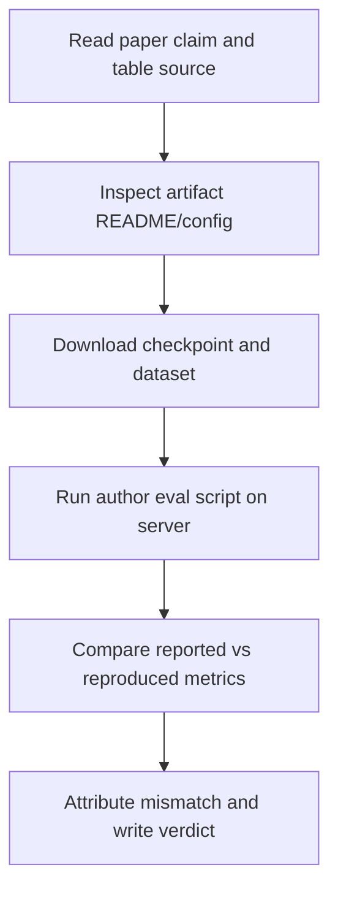

<!--
示例文件，只演示 STATE.md 写法。论文、数字、路径均为占位示例，不代表真实审查结果。
-->

# example-paper-audit

> 一句话：审查 Example et al. 2026 的 reported accuracy claim 是否能由作者 artifact 支撑。当前判断是 PARTIAL：主表核心趋势复现，但绝对数值低 2.1pp，且原仓库缺少两个 preprocessing 参数。

## 1. 目标与背景

### 1.1 目标论文/案例

| 字段 | 内容 |
|------|------|
| Paper/case id | arXiv:2601.00000 |
| Title | Example Method for Robust Widget Classification |
| Source | arXiv + GitHub artifact |
| Artifact | code + pretrained checkpoint, dataset script incomplete |
| Topic | `topic.md` |
| Landscape | `landscape.md` |

### 1.2 必要背景

这篇论文声称一个轻量模型在 Widget-5 benchmark 上超过强基线 3.4pp。这个 claim 值得审查，因为后续项目可能复用它的 checkpoint 和 preprocessing。风险点是论文主表只写了 dataset name，没有写 exact split seed 和 normalization 参数。

### 1.3 核心概念

| 概念 | 一句话解释 |
|------|-----------|
| Widget-5 | 五类 widget 图像分类 benchmark，官方提供 train/val/test split |
| reported artifact | 作者仓库中的训练脚本、config、checkpoint 和 README |
| exact-match reproduction | 用作者 artifact 尽量复现作者报告的数字，不自行改方法 |

### 1.4 审查问题

目标 claim 是 Table 2 的 "ExampleNet reaches 84.7% accuracy on Widget-5 test"。这个 claim 重要，因为它决定该方法是否值得作为 baseline。当前最大不确定性是 artifact 缺 preprocessing 参数，可能导致数字偏低。

## 2. 验证全景

### 2.1 验证流程



### 2.2 证据标准

| 检查/指标 | 含义 | 如何计算或判断 | 支持哪些 claim |
|-----------|------|----------------|----------------|
| Test accuracy | 论文主表核心数字 | 作者 eval script 输出 `accuracy` | C1 |
| Config completeness | artifact 是否足以复现 | README/config 是否包含 split、normalization、checkpoint hash | C2 |
| Baseline parity | reported baseline 是否同环境可跑 | 同一 eval script 跑 baseline checkpoint | C3 |

### 2.3 验证矩阵

| 检查 | 问题 | 层级 | 数据/资产 | 状态 | 当前信号 |
|------|------|------|-----------|------|----------|
| R1 author eval | 主模型数字能否复现 | direct reproduction | checkpoint + Widget-5 | OK | 82.6%, 比 reported 低 2.1pp |
| R2 config audit | artifact 是否完整 | static | README + config | WARN | 缺 split seed 和 normalization |
| R3 baseline eval | baseline 差距是否一致 | direct reproduction | baseline ckpt | TODO | 未跑 |

## 3. 资产、代码与环境

### 3.1 资产状态

| 资产 | 来源 | 路径/URL | manifest | 状态 |
|------|------|----------|----------|------|
| ExampleNet checkpoint | author GitHub release | `data/checkpoints/examplenet.pt` | `data/MANIFEST.md` | available |
| Widget-5 dataset | official mirror | `data/widget5/` | `data/MANIFEST.md` | available |
| preprocessing config | author repo | `conf/author.yaml` | `data/MANIFEST.md` | suspect |

### 3.2 代码地图

| 想知道... | 文件 | 函数/类 |
|----------|------|--------|
| eval 命令怎么跑 | `scripts/eval_author.py` | `main()` |
| metric 怎么算 | `src/example/metrics.py` | `accuracy()` |
| 数据怎么加载 | `src/example/data.py` | `Widget5Dataset` |

### 3.3 计算环境

R1 在 `server-a` 的 workspace 跑完，单卡 A6000 约 40 分钟。后续 R3 预计 1 GPU-hour。所有结果必须同步 manifest、stdout log、stderr log 和 metrics json。

## 4. 当前证据

### 4.1 已完成检查

| 检查 | 记录数/样本数 | 关键数字或事实 | 结论 |
|------|--------------|----------------|------|
| R1 author eval | 5000 test images | accuracy 82.6%; reported 84.7% | 部分支持趋势，不支持 exact number |
| R2 config audit | 17 files | README/config 缺 split seed 和 normalization | artifact incomplete |

### 4.2 关键警告

1. R1 用了 README 默认 normalization；如果作者实际用了未公开 normalization，当前 mismatch 不能直接判定论文 claim 错。
2. R3 baseline 还没跑，无法判断 2.1pp gap 是主模型特有还是全 pipeline 偏移。

### 4.3 Claims 速查

| claim_id | 目标 claim | source_refs | verification_level | evidence_refs | entailment | failure_attribution | 强度 |
|----------|------------|-------------|--------------------|---------------|------------|---------------------|------|
| C1 | ExampleNet 在 Widget-5 test 达到 84.7% accuracy | paper:Table2 | direct reproduction | commit:abc1234; run:results/r1_author_eval/manifest.json; result:results/r1_author_eval/metrics.json#accuracy; audit:audits/audit_iter3_example.md | PARTIAL | artifact incomplete / possible metric mismatch | 弱 |
| C2 | 作者 artifact 足以复现 Table 2 | paper:AppendixA; repo:README | static | log:results/r2_config_audit/config_audit.md | CONTRADICTED | missing config | 够 |
| C3 | reported improvement over baseline is robust | paper:Table2 | direct reproduction | — | UNTESTED | unknown | 不够 |

## 5. 战略决策（人类决定）

- 先跑 R3 baseline parity，再决定是否联系作者询问 preprocessing。
- 不准把 C1 降级成 "roughly comparable" 后声称 supported；报告必须保留 84.7% exact number mismatch。

## 6. 下一步行动

| 优先级 | 行动 | deadline | 完成标志 |
|--------|------|----------|----------|
| P0 | 跑 R3 baseline eval | 今天 | `results/r3_baseline_eval/manifest.json` + metrics |
| P1 | 整理 preprocessing 缺口 | 今天 | `results/r2_config_audit/config_audit.md` 补 source refs |
| P1 | reviewer 可靠性评分 | R3 后 | `<review>` block 更新 |

### 6.1 报告框架速览

1. Target claim and why it matters
2. Artifact inventory and missing config
3. Author eval reproduction result
4. Baseline parity result
5. Reliability verdict and remaining uncertainty

---

# Agent 执行层

## A0. Audit Response

| audit issue | scientist response | action/evidence | status |
|-------------|--------------------|-----------------|--------|
| [AUD-MAJOR-001] R1 metric source path missing stdout log | Accept | Synced `results/r1_author_eval/stdout.log`, manifest updated | resolved |
| [AUD-MINOR-001] C1 wording too strong before R3 | Accept | C1 entailment changed SUPPORTED → PARTIAL, strength weak | resolved |

## A1. Experiments-to-do

### Task Group A: baseline parity

- runs: [r3_baseline_eval]
- can_split: false
- depends_on: none
- priority: P0

### Run: r3_baseline_eval

- Task Group: A
- Owner: scientist
- Purpose: baseline
- Claim IDs: [C3]
- Verification level: direct reproduction
- Cost tier: L2
- Prior gate evidence: results/r2_config_audit/config_audit.md
- Advances: 判断 baseline 是否也出现 2pp 左右偏移，从而区分 global pipeline mismatch 和 method-specific mismatch
- Config / procedure: `uv run python scripts/eval_author.py --config conf/baseline.yaml --split test --output results/r3_baseline_eval`
- Input assets: `data/checkpoints/baseline.pt`, `data/widget5/`, exact paths in `data/MANIFEST.md`
- Expected outputs: `results/r3_baseline_eval/manifest.json`, `metrics.json`, `stdout.log`, `stderr.log`
- Allowed verdicts: SUPPORTED / PARTIAL / CONTRADICTED / NOT_REPRODUCIBLE / NOT_ASSESSABLE / OUT_OF_BUDGET
- Forbidden inference: R3 不能单独证明 C1，只能解释 mismatch 来源
- Failure attribution plan: 若 checkpoint missing → missing data; 若 script crash → our bug or artifact broken; 若 metric offset matches R1 → metric/preprocessing mismatch
- Priority: MUST-RUN
- Compute cost cap: $1, 1 GPU-hour
- Server: server-a + fallback server-b
- remote_dir: `/export/example/example-paper-audit`
- Success criterion: baseline accuracy 与 reported baseline 差距绝对值 ≤0.5pp，或明确记录差距和原因
- Failure interpretation: 若无法跑通，C3 保持 NOT_ASSESSABLE
- Risk: checkpoint hash 可能与 README 不一致

### 代码改动

无计划新功能。只允许修 manifest/logging 小 bug。

## A2. 验证详细规格

### E1: Author artifact eval

- 模型 / 数据 / 超参 / seeds: author checkpoint, Widget-5 test, deterministic eval
- 对比系统: paper Table 2 reported number
- 输入资产、输出文件与 source 路径: `data/MANIFEST.md`, `results/r1_author_eval/metrics.json`
- 结果: accuracy 82.6%
- 失败归因规则: exact number mismatch 先归因为 artifact/config incomplete，不能直接归因 paper claim wrong

## A3. Runs

| run | owner | purpose | server | remote_dir | launched_at | session_id | crash_count | phase |
|-----|-------|---------|--------|------------|-------------|------------|-------------|-------|
| r3_baseline_eval | scientist | baseline | server-a | /export/example/example-paper-audit |  |  | 0 | needs_impl |

## A4. 环境

| 服务器 | GPU | 显存 | 远程路径 | HF_HOME | 注意 |
|--------|-----|------|----------|---------|------|
| server-a | A6000 | 48GB | `/export/example/example-paper-audit` | `/export/cache/hf` | 主力 |

```bash
# server-side smoke test in workspace
uv run python scripts/eval_author.py --config conf/baseline.yaml --dry-run

# server-side lint + test
uv run ruff check . && uv run pytest
```

## A5. 运行历史

| 时间 | 实验 | 事件 | 备注 |
|------|------|------|------|
| 2026-07-03 10:20 | R1 | collected | author eval synced |
| 2026-07-03 11:05 | R2 | collected | config audit synced |

## A6. 已知问题与修复

| 问题 | 根因 | 修复 | 状态 |
|------|------|------|------|
| stdout log 未进 manifest | logging 脚本漏登记 | manifest 更新 | 已修 |

<review score="6.0" date="2026-07-03">

Primary concern: C1 目前只能给 PARTIAL。R3 baseline parity 未完成前，不应写成 supported reproduction。

</review>
